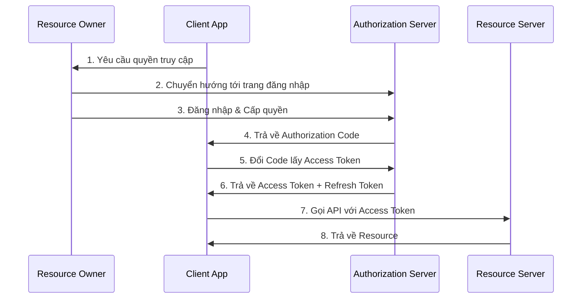
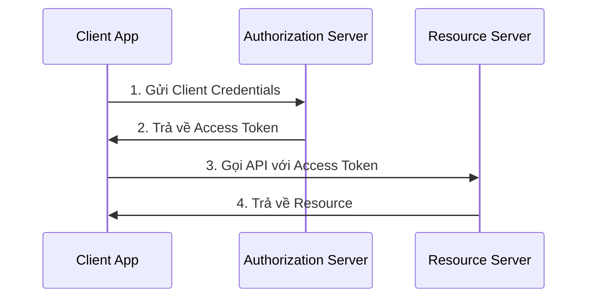
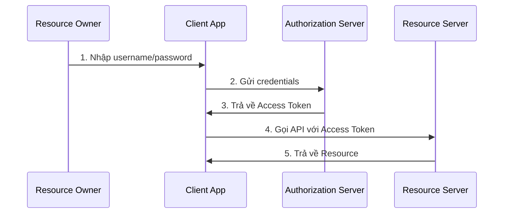

# OAuth 2.0 Flow và Cơ chế hoạt động

## 1. Các thành phần chính

1. **Resource Owner (User)**
   - Người dùng sở hữu tài nguyên
   - Người có quyền cấp quyền truy cập

2. **Client Application**
   - Ứng dụng bên thứ 3 muốn truy cập tài nguyên
   - Ví dụ: Ứng dụng mobile muốn truy cập Google Drive

3. **Authorization Server**
   - Server xác thực và cấp quyền
   - Phát hành access token và refresh token
   - Ví dụ: Google's authorization server

4. **Resource Server**  
   - Server chứa tài nguyên của user
   - Ví dụ: Google Drive API

## 2. Các loại Flow chính

### 1. Authorization Code Flow

### 2. Client Credentials Flow (Service-to-Service)

### 3. Password Grant Flow

## 3. Token System

### Access Token
- Token ngắn hạn (thường 1 giờ)
- Dùng để truy cập tài nguyên
- JWT hoặc Reference Token
- Chứa thông tin về scope và quyền

### Refresh Token
- Token dài hạn (có thể nhiều ngày/tháng)
- Dùng để lấy access token mới
- Phải được bảo mật cao
- Có thể thu hồi

## 4. Scope System
- Giới hạn quyền truy cập
- Ví dụ scope:
  - read:profile
  - write:data
  - delete:items

## 5. Bảo mật

### State Parameter
- Ngăn chặn CSRF attacks
- Random string gửi và nhận lại
- Verify để đảm bảo request hợp lệ

### PKCE (Proof Key for Code Exchange)
- Bảo vệ authorization code
- Dùng cho mobile và native apps
- Thay thế client secret

## 6. Token Lifecycle

1. **Cấp Token**
   - Verify grant
   - Generate tokens
   - Lưu trữ token info

2. **Sử dụng Token**
   - Gửi kèm trong header
   - Resource server verify
   - Check scope và expiration

3. **Refresh Token**
   - Access token hết hạn
   - Dùng refresh token lấy token mới
   - Không cần user interaction

4. **Thu hồi Token**
   - User logout
   - Security concerns
   - Application uninstalled

## 7. Ưu điểm của OAuth 2.0

1. **Bảo mật**
   - Không chia sẻ credentials
   - Token có thời hạn
   - Có thể thu hồi quyền

2. **Linh hoạt**
   - Nhiều flow khác nhau
   - Phù hợp nhiều use case
   - Dễ scale

3. **Chuẩn hóa**
   - Được sử dụng rộng rãi
   - Nhiều thư viện hỗ trợ
   - Dễ integrate

## 8. Nhược điểm

1. **Phức tạp**
   - Setup phức tạp
   - Nhiều component
   - Cần hiểu rõ flow

2. **Overhead**
   - Token management
   - Multiple requests
   - State handling
