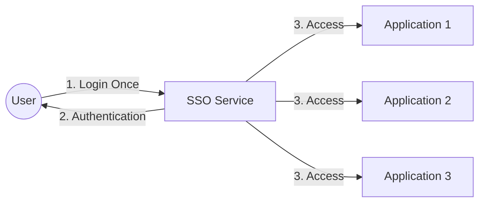
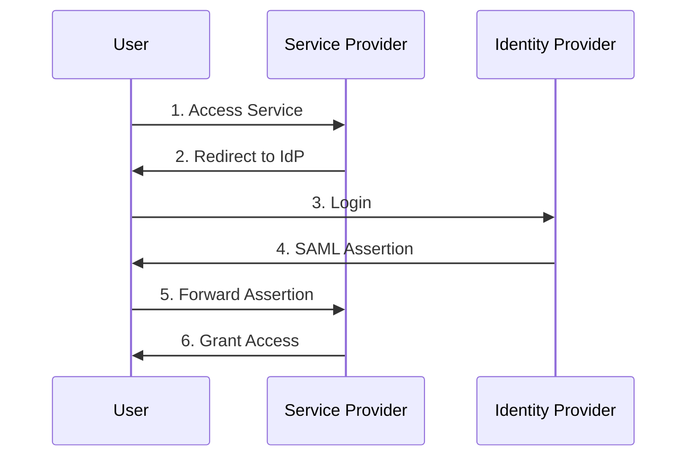
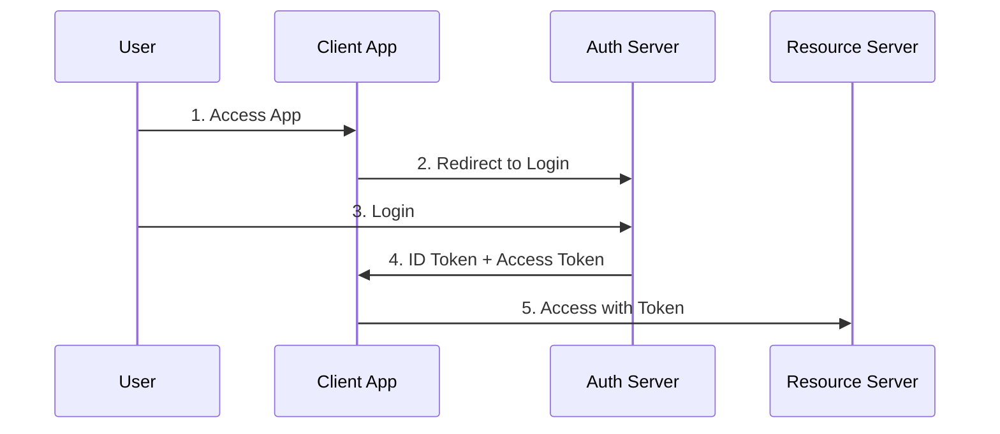

# Single Sign-On (SSO)

## 1. Khái niệm
SSO là cơ chế cho phép người dùng đăng nhập một lần và có thể truy cập nhiều ứng dụng/dịch vụ khác nhau mà không cần đăng nhập lại.

## 2. Các Protocol SSO phổ biến

### SAML (Security Assertion Markup Language)

### OAuth 2.0 + OpenID Connect

## 3. Các loại SSO

### 1. Enterprise SSO
- Dùng trong môi trường doanh nghiệp
- Tích hợp với LDAP/Active Directory
- Quản lý tập trung

### 2. Federated SSO
- Xác thực qua nhiều tổ chức
- Dùng các chuẩn như SAML
- Phù hợp B2B

### 3. Social SSO
- Đăng nhập qua mạng xã hội
- Dùng OAuth/OpenID Connect
- Phổ biến trong B2C

## 4. Use Cases

### 1. Enterprise
- Nhân viên truy cập nhiều ứng dụng nội bộ
- Quản lý quyền truy cập tập trung
- Tăng cường bảo mật

### 2. Education
- Sinh viên truy cập các dịch vụ trường học
- Thư viện, email, học trực tuyến
- Quản lý dễ dàng

### 3. B2C Applications
- Người dùng truy cập ecosystem của công ty
- Ví dụ: Google services
- Trải nghiệm người dùng tốt

## 5. Ưu điểm và Nhược điểm

### Ưu điểm
1. **User Experience**
   - Đăng nhập một lần
   - Truy cập nhiều dịch vụ
   - Giảm password fatigue

2. **Security**
   - Quản lý tập trung
   - Strong authentication
   - Audit logging

3. **Management**
   - Quản lý user dễ dàng
   - Policy tập trung
   - Giảm support cost

### Nhược điểm
1. **Single Point of Failure**
   - SSO down = tất cả apps down
   - Security risk tập trung
   - Cần high availability

2. **Implementation**
   - Setup phức tạp
   - Cần expertise
   - Cost cao

3. **Security Risks**
   - Token hijacking
   - Session risks
   - Phishing attacks

## 6. Best Practices

### 1. Security
- Multi-factor authentication
- Token encryption
- Session management
- Regular audits

### 2. Implementation
- Choose right protocol
- Plan for scalability
- Disaster recovery
- Monitor performance

### 3. User Experience
- Smooth login flow
- Clear error messages
- Password policies
- Self-service options
